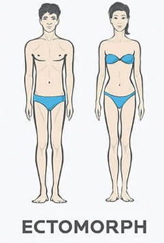
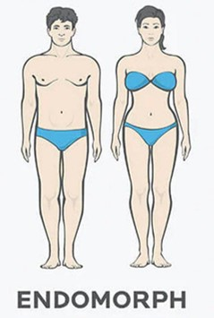
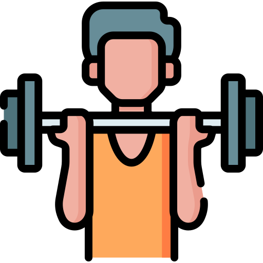

<p align="center">
    
</p>

<p align="center">
<a href="https://dio.me/"></a>
<a href="https://www.gnu.org/software/bash/" title="Go to Bash homepage"></a>
<a href="https://aws.amazon.com/" title="Powered by AWS">
  
</a>
</p>

<p align="center">
  <h3 align="center">🏋️‍♂️ Assistente de Personal Trainer - Gerador de Treino Ideal</h3>
Este projeto é um desafio de Prompt Engineer, onde o objetivo é criar um prompt que ajuda a montar o treino ideal para cada combinação de fatores, como biotipo corporal, disponibilidade de tempo e tipo de exercícios preferidos. O assistente de personal trainer gerado por esse prompt será capaz de personalizar os treinos de acordo com as características e necessidades do usuário.
O projeto deve ser feito utilizando as boas práticas de prompt engineer.
</p>

## 📋 Índice

- [📋 Índice](#-índice)
- [📝 Introdução](#-introdução)
- [💪 Biotipos Corporais](#-biotipos-corporais)
- [📅 Dias Disponíveis para Treino](#-dias-disponíveis-para-treino)
- [🏋️ Tipos de Exercícios](#️-tipos-de-exercícios)
- [🛠️ Regras de negócio](#️-regras-de-negócio)
- [📖 Material de Apoio](#-material-de-apoio)
- [🎯 Prompt de Resposta Proposto](#-prompt-de-resposta-proposto)

---

## 📝 Introdução

Este projeto visa criar um assistente de personal trainer automatizado que ajuda a gerar treinos personalizados. O usuário fornecerá informações como o biotipo corporal, a quantidade de dias disponíveis para treinar na semana e o tipo de exercício preferido, e o assistente gerará um plano de treino ideal com base nessas informações.

---

## 💪 Biotipos Corporais

A primeira regra para personalizar o treino é determinar o biotipo corporal do usuário. Existem três biotipos principais:

<table>
  <tr>
    <th>Imagem</th>
    <th>Biotipo</th>
    <th>Descrição</th>
  </tr>
  <tr>
    <td style="text-align: center;">
      
    </td>
    <td><strong>Ectomorfo</strong></td>
    <td>Corpo mais magro, difícil ganhar peso e massa muscular.</td>
  </tr>
  <tr>
    <td style="text-align: center;">
      
    </td>
    <td><strong>Mesomorfo</strong></td>
    <td>Corpo naturalmente musculoso, facilidade para ganhar massa muscular e perder gordura.</td>
  </tr>
  <tr>
    <td style="text-align: center;">
      
    </td>
    <td><strong>Endomorfo</strong></td>
    <td>Corpo com tendência a acumular gordura, maior dificuldade em perder peso.</td>
  </tr>
</table>

> **Nota:** Escolha o biotipo que mais se aproxima do seu corpo atual para que o treino seja mais eficiente.

---

## 📅 Dias Disponíveis para Treino

A segunda regra é determinar quantos dias por semana o usuário tem disponível para treinar. Dependendo do número de dias, o treino sugerido pode variar:

| **Imagem**                                                     | **Dias por Semana** | **Tipo de Treino Sugerido** |
| -------------------------------------------------------------- | ------------------- | --------------------------- |
|  | 1 dia               | Treino Full Body            |
|  | 3 dias              | Treino ABC                  |
|  | 5 dias              | Treino ABCDE                |

- **Full Body**: Treino que trabalha o corpo todo em uma única sessão.
- **ABC**: Divisão do treino em três dias, cada um focado em grupos musculares diferentes.
- **ABCDE**: Divisão do treino em cinco dias, com foco ainda mais específico em cada grupo muscular.

---

## 🏋️ Tipos de Exercícios

A terceira regra envolve a escolha do tipo de exercício preferido. Aqui estão algumas categorias com exemplos:

| **Imagem**                                                       | **Tipo de Treino** | **Descrição**                                                                                                 |
| ---------------------------------------------------------------- | ------------------ | ------------------------------------------------------------------------------------------------------------- |
|  | **Funcional**      | Exercícios que melhoram a funcionalidade do corpo, usando movimentos naturais.                                |
|   | **Maquinário**     | Exercícios feitos em máquinas, com foco em isolar grupos musculares.                                          |
|      | **Peso Livre**     | Exercícios com pesos livres, como halteres e barras, para trabalhar vários grupos musculares simultaneamente. |
|    | **Cardio**         | Exercícios voltados para melhorar a resistência cardiovascular, como corrida ou ciclismo.                     |
|      | **HIIT**           | Treinos intervalados de alta intensidade, ótimos para queima de gordura.                                      |

---

## 🛠️ Regras de negócio

1. **Identifique seu biotipo corporal** consultando a seção de biotipos.
2. **Determine quantos dias por semana você pode treinar** e escolha o tipo de treino mais adequado.
3. **Selecione o tipo de exercício** que prefere realizar e que se encaixa melhor nos seus objetivos.
4. Use o prompt do assistente para gerar um plano de treino personalizado.

---

## 📖 Material de Apoio

Aqui estão alguns recursos adicionais que podem ser úteis para entender melhor o projeto e as práticas de prompt engineering:

- [Fundamentos de Engenharia de prompt](https://elidianaandrade.gitbook.io/fundamentos-de-engenharia-de-prompts-com-claude-3)
- [Boas práticas de prompt](https://aline-antunes.gitbook.io/otimize-seus-prompts-e-aprenda-mais-usando-ias-1)

---

## 🎯 Prompt de Resposta Proposto

### Descrição:
Prompt considerando o que foi definido no readme.md, porém criando 2 Planos de Treino:

   **01 - Plano de Treino - Academia**    (para ser realizado na Academia)
   
   **02 - Plano de Treino - Calistenia**  (para ser realizado em casa no conceito Calistenia)

### 👤 + 📄 PROMPT:

```
<instrucoes>
     <contexto> 
       Você é um experiente Personal Trainer e irá definir o melhor treino baseado:
          - Nos 3 fatores que irá receber e
          - Tarefas descritas.
     </contexo> 
     <fatores>
         <biotipos>
             - Ectomorfo: Corpo mais magro, difícil ganhar peso e massa muscular.
             - Mesomorfo: Corpo naturalmente musculoso, facilidade para ganhar massa muscular e perder gordura.
             - Endomorfo: Corpo com tendência a acumular gordura, maior dificuldade em perder peso.
          </biotipos>
          <dias_disponiveis>
              - 1 dia: Treino Full Body.
              - 3 dias: Treino ABC.
              - 5 dias: Treino ABCDE.
          </dias_disponiveis>
          <tipos_exercicios>
              - Funcional: Exercícios que melhoram a funcionalidade do corpo, usando movimentos naturais.
              - Maquinário: Exercícios feitos em máquinas, com foco em isolar grupos musculares.
              - PesoLivre: Exercícios c/ pesos livres, como halteres e barras, p/ trabalhar vários grupos musculares simultaneamente.
              - Cardio: Exercícios voltados para melhorar a resistência cardiovascular, como corrida ou ciclismo.
              - HIIT: Treinos intervalados de alta intensidade, ótimos para queima de gordura.
          </tipos_exercicios>
      </fatores>
      <tarefas>
          - Identifique o biotipo corporal que foi informado, consultando a seção de biotipos;
          - Identifique a quantidade de dias por semana que foi informado; e escolha o tipo de treino mais adequado.
          - Identifique o tipo de exercício preferido que foi informado; e que se encaixa melhor nos objetivos.
          - Gere 2 Planos de Treinos personalizados:
            - 01 - Academia: de acordo com as informações identificadas acima em um ambiente de Academia.
            - 02 - Calistenia: de acordo com as informações identificadas acima, porém baseado em calistenia.
      </tarefas>
</instrucoes>

<formatacao_resposta>
  <estilo>
        Gere o Plano em um estilo resumido com termos de fácil entendimento.
  </estilo>
  <estrutura>
        Gere o Plano numa estrutura de tópicos numerados para facilitar o entendimento e leitura.
  </estrutura>
</formatacao_resposta>

<user>
    <fator_biotipo>
        Endomorfo
    </fator_biotipo>
    <fator_dias_disponiveis>
        5 dias
    </fator_dias_disponiveis>
    <fator_tipos_exercicio>
        Cardio e HIIT
    </fator_tipos_exercicio>
</user>
```

### 🤖 RESULTADO - CLAUDE.AI:

Olá! Aqui está um Plano de Treino personalizado para você, de acordo com as informações fornecidas:

**Biotipo Corporal:** *Endomorfo*

**Dias Disponíveis por Semana:** *5 dias*

**Tipos de Exercícios Preferidos:** *Cardio e HIIT*


### Plano de Treino 1 - Academia:

1. Aquecimento:
   - 10-15 minutos de exercícios cardiovasculares leves, como caminhada rápida ou bicicleta.

2. Exercícios Aeróbicos/HIIT:
   - 30-40 minutos de exercícios HIIT, como sprints, burpees, saltos de caixote.
   - Intercale períodos de alta intensidade com períodos de recuperação ativa.

3. Exercícios de Força:
   - 3 séries de 10-12 repetições de exercícios compostos, como agachamentos, remadas e supino.
   - Foque em grupos musculares maiores, como pernas, costas e peito.

4. Exercícios de Cardio:
   - 20-30 minutos de exercícios contínuos de cardio, como corrida, natação ou elíptico.

5. Alongamento e Relaxamento:
   - 10-15 minutos de alongamento e exercícios de respiração.

### Plano de Treino 2 - Calistenia:

1. Aquecimento:
   - 10-15 minutos de exercícios dinâmicos, como polichinelos, agachamentos e estrelas.

2. Exercícios de Força e Resistência:
   - 3 séries de 8-10 repetições de exercícios calistênicos, como flexões, abdominal, prancha.
   - Foque em exercícios que envolvam o peso corporal.

3. Exercícios Aeróbicos/HIIT:
   - 20-30 minutos de exercícios HIIT, como burpees, saltos, mountain climbers.
   - Intercale períodos de alta intensidade com períodos de recuperação ativa.

4. Exercícios Cardio:
   - 15-20 minutos de exercícios contínuos de cardio, como corrida, pular corda ou corrida de escada.

5. Alongamento e Relaxamento:
   - 10-15 minutos de alongamento e exercícios de respiração.

Observação: Certifique-se de aumentar gradualmente a intensidade e duração dos exercícios à medida que seu condicionamento melhorar. Lembre-se de sempre se hidratar adequadamente e descansar entre os treinos.
